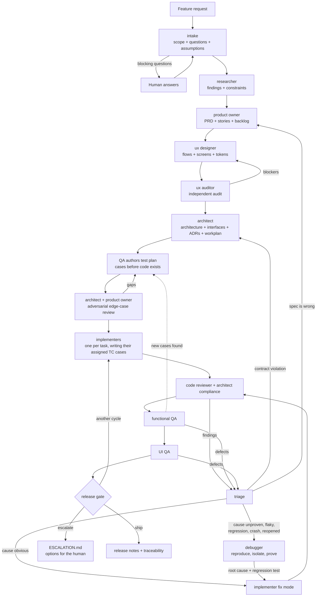

# How the pipeline runs

## Flow

## Roles

| Agent | Owns | Never does |
|---|---|---|
| `sdlc-intake` | Scope, questions, assumptions | Design or estimate |
| `sdlc-researcher` | Findings, prior art, hard constraints | Decide scope |
| `sdlc-product-owner` | PRD, stories, acceptance criteria, priority, test-plan coverage review | Say how to build it |
| `sdlc-ux-designer` | Flows, screen specs, all states, copy, tokens | Change requirements silently |
| `sdlc-ux-auditor` | Independent usability and a11y audit | Defer to the designer |
| `sdlc-architect` | Architecture, interface contracts, ADRs, workplan, test-plan technical review | Write feature code |
| `sdlc-implementer` | Code and tests for one task, or one fix set | Redefine scope or contract |
| `sdlc-debugger` | Reproduction, isolation, **proven** root cause, blast radius | Implement the fix |
| `sdlc-code-reviewer` | Correctness, security, clean code, test quality | Fix what it finds |
| `sdlc-qa-functional` | The test plan (before code), execution, defect reports, fix verification | Pass on inspection alone |
| `sdlc-qa-ui` | The running interface vs the spec, responsive, a11y, console | Review UI it cannot run |
| `sdlc-release-gate` | The ship / cycle / escalate decision, traceability | Pass a gate to end a loop |

## Tests are specified before the code

QA writes the test plan in phase 6, from the acceptance criteria and the architecture, with no
implementation to look at. The architect reviews it for missing failure modes and wrong test
levels; the product owner reviews it for uncovered criteria and wrong expected results. Only an
approved plan unlocks implementation.

The approved cases then become **scheduled work**: the architect folds each `TC` id into the
workplan's definition of done, and implementers write those tests alongside the code. QA later
verifies not just that the tests pass, but that each one actually asserts what the plan said —
a test narrowed to fit the implementation is a blocker.

This ordering is the difference between finding edge cases as rework and building them in. What
QA discovers during execution is amended back into the plan, so coverage accumulates instead of
being rediscovered each cycle.

## Debugging path in detail

The pipeline treats "we fixed the symptom" as a defect in itself. Any issue whose cause is
not visible goes to the debugger, which must produce three separate things:

- **Proximate cause** — the code that misbehaves
- **Root cause** — the design or assumption that permitted it
- **Detection gap** — what should have caught it and did not

Plus the **blast radius**: every other place the same pattern appears, and whether existing
data is already wrong. Each additional site becomes its own linked issue. The fix must close
the root cause, ship the regression test the investigation specified, and address the
detection gap — otherwise the same defect returns next cycle wearing a different symptom.

An issue reopened twice cannot be fixed again without an investigation. Two failed fixes are
proof the cause was never found.

## Where things live

- `.sdlc/features/<slug>/` — one workspace per feature; layout in the protocol skill
- `.sdlc/features/<slug>/state.json` — pipeline position and gate status
- `.sdlc/features/<slug>/history/events.jsonl` — append-only event log
- `.sdlc/features/<slug>/history/runs/` — every agent run's full outcome
- `.sdlc/features/<slug>/bus/` — directed questions between agents, each with a default
- `.sdlc/features/<slug>/issues/` — every finding, one file each
- `.sdlc/features/<slug>/06-test-plan/plan.md` — the binding test contract
- `.sdlc/features/<slug>/11-investigations/` — root-cause investigations
- `docs/adr/` — architecture decision records, repo-wide

## Adapting it

- Swap `sdlc-implementer` for a stack specialist (backend, frontend, mobile) — keep the
  protocol sections on contracts, verification, and the task record.
- Add a security phase by inserting `security-auditor` into phase 8 alongside code review.
- Tune `max_cycles` in `state.json` per feature. Lower it for exploratory work so it
  escalates to a human sooner.
- Skip the design and UI QA phases for work with no user-facing surface, and record why in
  the run record rather than leaving the gate ambiguous.
