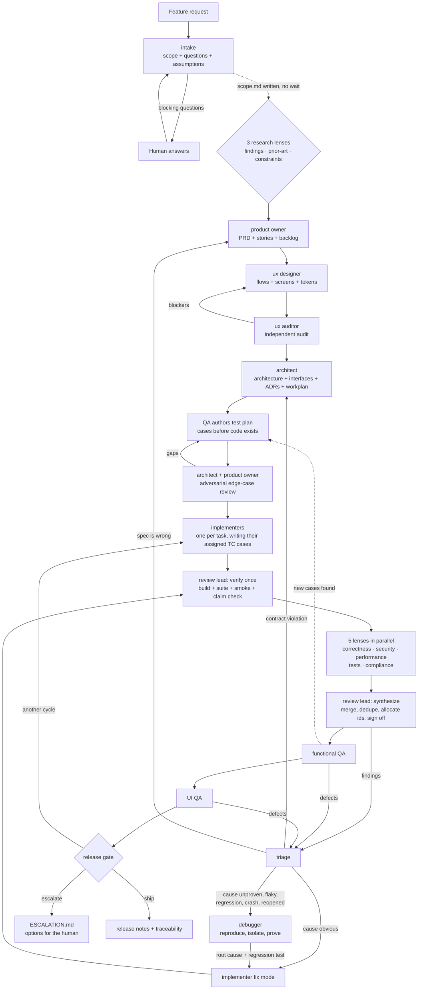

# How the pipeline runs

## Flow

## Roles

| Agent | Owns | Never does |
|---|---|---|
| `sdlc-intake` | Scope, questions, assumptions | Design or estimate |
| `sdlc-researcher-findings` | Existing code, reuse, conflicts | Decide scope, touch the network |
| `sdlc-researcher-prior-art` | How comparable products solve this problem | Decide scope |
| `sdlc-researcher-constraints` | Hard technical, legal, and convention limits | Present a preference as a wall |
| `sdlc-product-owner` | PRD, stories, acceptance criteria, priority, test-plan coverage review | Say how to build it |
| `sdlc-product-critic` | Uncovered user scenarios, falsifiable criteria, story quality | Rewrite the spec it critiques |
| `sdlc-business-analyst` | Problem evidence, value hypothesis, honest metrics, cost and alternatives | Manufacture confidence or doubt |
| `sdlc-ux-designer` | Flows, screen specs, all states, copy, tokens | Change requirements silently |
| `sdlc-ux-auditor` | Independent usability and a11y audit | Defer to the designer |
| `sdlc-architect` | Architecture, interface contracts, ADRs, workplan, test-plan technical review | Write feature code |
| `sdlc-implementer` | Code and tests for one task, or one fix set | Redefine scope or contract |
| `sdlc-debugger` | Reproduction, isolation, **proven** root cause, blast radius | Implement the fix |
| `sdlc-review-lead` | Running verification once, merging the lenses, global issue ids, mechanical fixes, the review verdict | Review a lens itself, or declare ship-readiness |
| `sdlc-code-reviewer` | Requirement fidelity, correctness, contracts, clean code | Run servers, edit code, allocate issue ids |
| `sdlc-review-security` | Authorization, injection, secrets, exposure, unsafe operations | Soften a finding because the fix is costly |
| `sdlc-review-performance` | N+1 access, unboundedness, indexes, timeouts, payload cost | Demand speculative optimization |
| `sdlc-review-tests` | Whether each test asserts what the plan required | Rewrite a test it judges |
| `sdlc-qa-functional` | The test plan (before code), execution, defect reports, fix verification | Pass on inspection alone |
| `sdlc-qa-ui` | The running interface vs the spec, responsive, a11y, console | Review UI it cannot run |
| `sdlc-contract-steward` | Boundary contracts, versioning, publication, breaking-change policy, drift | Implement, or decide product scope |
| `sdlc-integration-qa` | Conformance both directions, cross-repo journeys, version alignment, deploy order | Run before every participant passed its own gates |
| `sdlc-release-gate` | The ship / cycle / escalate decision, traceability | Pass a gate to end a loop |

## Product work can run on its own

`/sdlc-product` takes a raw request, an existing PRD, or a bare set of stories and produces a
specification worth building — then stops, before design and engineering.

It fans out four lenses in parallel over the spec: the **product critic** hunts the scenarios it
forgot (the churned user, existing users at migration, two people editing at once, what deletion
actually means) and every acceptance criterion that cannot be falsified; the **business analyst**
asks whether the problem is evidenced rather than asserted, whether the metric has a baseline and a
counter-metric, and what the do-nothing option costs; the **UX auditor** asks whether the described
experience can work at all; the **architect** gives a cost signal only, and its highest-value finding
is a requirement that would be far cheaper stated slightly differently.

The product owner then revises against all four and produces three deliverables, because a review
whose changes nobody can see has not delivered anything:

- **`specification.md`** — the consolidated final document, self-contained for someone who has read
  none of the review files. This is the thing you share.
- **`changes.md`** — every revision with the before and after as **quoted text**, not a description
  of a change, each citing the finding that drove it. "Clarified AC-2" is worthless; showing
  `"handles errors gracefully"` become `"returns 422 with code password_too_long and creates no
  session row"` is the entire point.
- **`recommendations.md`** — what was *not* applied because it needs a human decision or more
  evidence, ordered by impact, each naming exactly what would resolve it.

Deciding something is out of scope counts as covering it — leaving it undecided does not. No finding
is silently dropped; a rejection is a decision that needs a reason on the record. And where the
business case does not hold, it goes at the top of the recommendations rather than being buried,
since building something whose value nobody can evidence is the outcome this command exists to
prevent.

## Tests are specified before the code

QA writes the test plan in phase 6, from the acceptance criteria and the architecture, with no
implementation to look at. The architect reviews it for missing failure modes and wrong test
levels; the product owner reviews it for uncovered criteria and wrong expected results. Only an
approved plan unlocks implementation.

**Authoring starts before architecture finishes.** Most of the plan — the cases derived from
acceptance criteria and the edge-case checklist — needs only product and design; only the
failure-mode and error-code cases need `interfaces.md`. So QA begins the moment the UX audit
passes, running alongside the architect, and folds in the architecture-derived cases once they
land, before the plan goes to review.

The approved cases then become **scheduled work**: the architect folds each `TC` id into the
workplan's definition of done, and implementers write those tests alongside the code. QA later
verifies not just that the tests pass, but that each one actually asserts what the plan said —
a test narrowed to fit the implementation is a blocker.

This ordering is the difference between finding edge cases as rework and building them in. What
QA discovers during execution is amended back into the plan, so coverage accumulates instead of
being rediscovered each cycle.

## Review is five lenses in parallel, bracketed by a lead

One reviewer doing six jobs sequentially is slower and shallower than specialists doing one each.
Phase 8 runs in three steps, and `/sdlc-review` runs the same three standalone — on a feature slug,
a branch, a PR number, a path, or just the working diff:

1. **Verify, once.** `sdlc-review-lead` runs build, lint, type check, suite, and a smoke test of
   the primary path, then checks the implementer's claimed verification against what actually
   happened — a claim of passing tests that do not pass is a blocker, because downstream agents
   were handed false information. Result goes in `verification.md`. If the build is unusable it
   stops here rather than fanning out five reports about one broken compile.

2. **Five lenses concurrently**, each reading that verification instead of re-running anything:
   correctness and requirement fidelity, security, performance, test honesty, and architectural
   compliance. Each writes one file and emits **local** finding ids (`SEC-3`, `PERF-2`) because
   concurrent global id allocation races.

3. **Synthesize.** The lead merges and deduplicates — one unbounded query is a correctness,
   performance, and denial-of-service finding, and it becomes one issue naming all three lenses.
   Severity conflicts resolve upward with both positions recorded. It then allocates the global
   `ISSUE` ids, applies mechanical fixes sequentially, and looks for the cross-cutting pattern no
   single lens could see: several findings sharing one root cause, or a subsystem drawing findings
   from every lens that needs rework rather than patches.

**Fix authority is bounded and singular.** Only the lead edits, and only mechanically — typos,
dead code, misleading names, obvious duplication. Anything touching logic, control flow, data,
security, concurrency, contracts, or test assertions goes back to the implementer, because an
agent that fixes a logic defect becomes its author and no independent judge remains. Parallel
lenses propose fixes and never apply them; four agents editing one tree corrupts it.

Every verification agent ends with a sign-off naming its verdict, what it ran, what it verified,
and **what it could not verify and why**. That last line is what makes the sign-off honest. Each
sign-off is scoped to its own gate: only the release gate declares ship-readiness, and it does so
by auditing the others — including checking that no sign-off is stale after a later code change,
and that nobody signed off on work they authored.

## Debugging path in detail

The pipeline treats "we fixed the symptom" as a defect in itself. Any issue whose cause is
not visible goes to the debugger, which must produce three separate things:

- **Proximate cause** — the code that misbehaves
- **Root cause** — the design or assumption that permitted it
- **Detection gap** — what should have caught it and did not

Plus the **blast radius**: every other place the same pattern appears, and whether existing
data is already wrong. Each additional site becomes its own linked issue. The fix must close
the root cause, ship the regression test the investigation specified, and address the
detection gap — otherwise the same defect returns next cycle wearing a different symptom.

An issue reopened twice cannot be fixed again without an investigation. Two failed fixes are
proof the cause was never found.

## Where things live

- `.sdlc/features/<slug>/` — one workspace per feature; layout in the protocol skill
- `.sdlc/features/<slug>/state.json` — pipeline position and gate status
- `.sdlc/features/<slug>/history/events.jsonl` — append-only event log
- `.sdlc/features/<slug>/history/runs/` — every agent run's full outcome
- `.sdlc/features/<slug>/bus/` — directed questions between agents, each with a default
- `.sdlc/features/<slug>/issues/` — every finding, one file each
- `.sdlc/features/<slug>/06-test-plan/plan.md` — the binding test contract
- `.sdlc/features/<slug>/11-investigations/` — root-cause investigations
- `.sdlc/features/<slug>/digest/` — short human-facing briefs derived by `/sdlc-digest`; read by
  people, never by agents, and safe to delete
- `docs/adr/` — architecture decision records, repo-wide

## Adapting it

- Swap `sdlc-implementer` for a stack specialist (backend, frontend, mobile) — keep the
  protocol sections on contracts, verification, and the task record.
- Add a security phase by inserting `security-auditor` into phase 8 alongside code review.
- Tune `max_cycles` in `state.json` per feature. Lower it for exploratory work so it
  escalates to a human sooner.
- Skip the design and UI QA phases for work with no user-facing surface, and record why in
  the run record rather than leaving the gate ambiguous.
